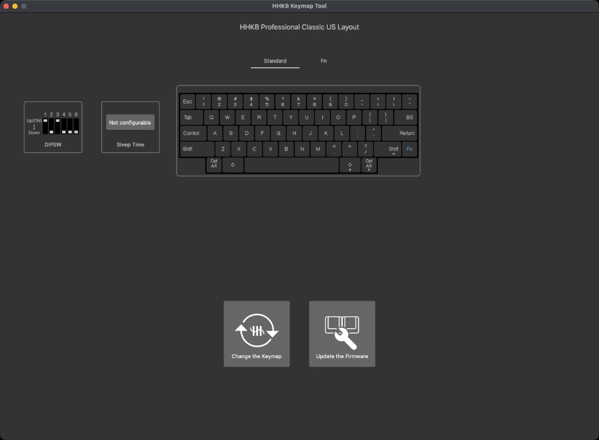

# hhkb-keymap-tool-patch

Use the official **HHKB Keymap Tool** to remap the keys on an **HHKB Professional
(Classic)**, a model the tool does not support out of the box.



> ## Disclaimer
>
> Not affiliated with or endorsed by PFU / Happy Hacking Keyboard. Modifying an
> application bundle is at your own risk. Keep the automatic backup so you can
> restore the original.

## What this does

PFU's HHKB Keymap Tool can only remap keyboards that appear in its built-in list
of supported models. The **HHKB Professional (Classic)** is not in that list, so
the tool refuses to remap it even though the hardware supports it.

This project makes the Classic (and other missing models) usable by editing that
built-in list, on both **macOS** and **Windows**. The tool lets you export that
list, edit it, and write it back so the app recognizes the additional keyboard
definitions, after which you can remap the Classic from the normal Keymap Tool
UI.

Where the list lives depends on the platform:

- **macOS** embeds it as a JSON blob named `KeyboardDatalist` inside the app's
  compiled asset catalog (`Assets.car`), so it must be surgically patched.
- **Windows** keeps it as a plain `keyboardDataList.json` file next to the app, so
  the tool simply backs it up and replaces it.

The bundled `KeyboardDatalist.json` already contains the entries needed to expose
the Classic, so for most people patching with the default file is all that's
required.

This project builds on the approach described in the r/HHKB thread
[Remapping the Classic with the HHKBKeymapTool](https://www.reddit.com/r/HHKB/comments/g9ciwp/remapping_the_classic_with_the_hhkbkeymaptool/).
The bundled `KeyboardDatalist.json` is a merge of
[crsayen's gist](https://gist.github.com/crsayen/dfa2197884f11d7e917c7637c8764ecd)
with the list from Keymap Tool 2.0.1 (2026-01). On shared type numbers the bundled
file wins (so Classic stays remappable). After a Keymap Tool update, re-export the
app list, re-merge into `KeyboardDatalist.json` if PFU changed fields, then patch
again.

## Supported models

Type numbers present in the bundled `KeyboardDatalist.json` (68 entries). All are
marked `isKeymapChangeable: true`. Suffixes `-PPM` and `-EM` are regional/SKU
variants of the same base model.

| Family | Type numbers |
|--------|----------------|
| Professional Classic | `PD-KB401W`, `PD-KB401B`, `PD-KB401WN`, `PD-KB401BN` (+ `-PPM`, `-EM`) |
| Professional Classic Type-S | `PD-KB401WSC`, `PD-KB401BSC`, `PD-KB401YSC` |
| Professional Classic Type-S (JIS) | `PD-KB421WSC`, `PD-KB421BSC`, `PD-KB421YSC` |
| Professional HYBRID | `PD-KB800W`, `PD-KB800B`, `PD-KB800WN`, `PD-KB800BN`, `PC-KB800W` (+ `-PPM`, `-EM` on `PD-*`) |
| Professional HYBRID (JIS) | `PD-KB820W`, `PD-KB820B`, `PC-KB820W` (+ `-PPM`, `-EM` on `PD-*`) |
| Professional HYBRID Type-S | `PD-KB800WS`, `PD-KB800BS`, `PD-KB800WNS`, `PD-KB800BNS` (+ `-PPM`, `-EM`); Snow: `PD-KB800YS`, `PD-KB800YSC`, `PD-KB800YNS`; 30g: `PD-KB800WSC1`, `PD-KB800BSC1`, `PD-KB800YSC1` |
| Professional HYBRID Type-S (JIS) | `PD-KB820WS`, `PD-KB820BS` (+ `-PPM`, `-EM`); Snow: `PD-KB820YS`, `PD-KB820YSC`, `PD-KB820YNS`; 30g: `PD-KB820WSC1`, `PD-KB820BSC1`, `PD-KB820YSC1` |

Your model is covered if its bottom-label type number appears above (for example
`PD-KB401B` for Classic charcoal/printed).

## Requirements

- macOS (uses `/usr/bin/assetutil`) or Windows (plain JSON copy, no `assetutil` needed)
- Python 3.8+ (standard library only, no `pip install` needed)

## Usage

### macOS

1. Build a patched catalog in the current folder (reads the installed app's
   `Assets.car`, applies the bundled `KeyboardDatalist.json`, writes `./Assets.car`
   and `./Assets.car.bak`):

   ```bash
   python3 hhkb_patch.py
   ```

2. Install it with Finder:

   - Open `/Applications`, right-click **Happy Hacking Keyboard Keymap Tool**,
     and choose **Show Package Contents**.
   - Go to `Contents` → `Resources`.
   - Drag the patched `./Assets.car` from this project folder onto the existing
     `Assets.car` in `Resources`, and confirm you want to replace it.
   - Enter your password if macOS asks for authentication.

3. Open Happy Hacking Keyboard Keymap Tool and remap as usual.

### Windows

On Windows the keymap list is a plain JSON file. From an **Administrator**
command prompt or PowerShell, the tool backs up and overwrites it directly:

```bat
python hhkb_patch.py
```

Default target:

`C:\Program Files\PFU\Happy Hacking Keyboard Keymap Tool\keyboardDataList.json`

Then open Happy Hacking Keyboard Keymap Tool and remap as usual.

Alternatively, replace the file manually in File Explorer:

1. Go to `C:\Program Files\PFU\Happy Hacking Keyboard Keymap Tool\`.
2. Optionally back up the existing `keyboardDataList.json` somewhere safe.
3. Copy `KeyboardDatalist.json` from this project folder into that directory,
   replacing `keyboardDataList.json` (same contents; the app uses that
   filename). Confirm the UAC/admin prompt if Windows asks.

### More options

```bash
# Use your own JSON instead of the bundled KeyboardDatalist.json
python3 hhkb_patch.py my.json

# Export the app's current list without patching
python3 hhkb_patch.py --export current.json

# Non-default install locations
python3 hhkb_patch.py --car /path/to/Assets.car
python hhkb_patch.py --datalist "C:\path\to\keyboardDataList.json"
```

Backups are always written in the current directory (`./Assets.car.bak` or
`./keyboardDataList.json.bak`). If that file already exists and differs from the
current source, it is kept and a timestamped backup of the current source is
written beside it (for example `./Assets.car.20260121-153045.bak`).

## Testing

To run the tests, you'll need `pytest`. Install the development requirements first:

```bash
pip install -r requirements-dev.txt
pytest test_hhkb_patch.py
```

- **Unit tests** exercise the pure byte-manipulation helpers against synthetic
  BOM/CSI fixtures; these run anywhere, no tools required.
- **Integration tests** drive the full CLI against the real installed `Assets.car`
  via `assetutil`; they self-skip if the app or `assetutil` is unavailable, and never
  modify the installed catalog (they operate on temporary files).

Integration coverage includes: export, byte-identical round-trip, grow/shrink patches,
verification that all other assets stay untouched, backup behavior, and error
handling.

## License

Released under the [MIT License](LICENSE).

## Credits

- Original remapping technique: the r/HHKB thread
  [Remapping the Classic with the HHKBKeymapTool](https://www.reddit.com/r/HHKB/comments/g9ciwp/remapping_the_classic_with_the_hhkbkeymaptool/).
- `KeyboardDatalist.json`: [crsayen's gist](https://gist.github.com/crsayen/dfa2197884f11d7e917c7637c8764ecd),
  merged with entries from Keymap Tool 2.0.1 (2026-01).

